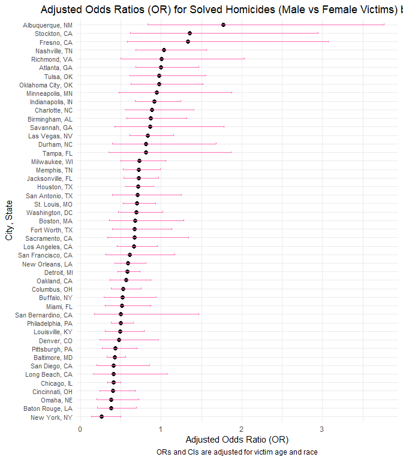
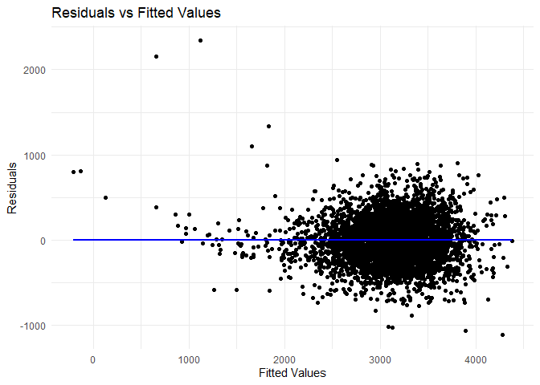

p8105_hw6_pm3260
================
Pradeeti Mainali
2024-11-21

``` r
library(tidyverse)
```

    ## ── Attaching core tidyverse packages ──────────────────────── tidyverse 2.0.0 ──
    ## ✔ dplyr     1.1.4     ✔ readr     2.1.5
    ## ✔ forcats   1.0.0     ✔ stringr   1.5.1
    ## ✔ ggplot2   3.5.1     ✔ tibble    3.2.1
    ## ✔ lubridate 1.9.3     ✔ tidyr     1.3.1
    ## ✔ purrr     1.0.2     
    ## ── Conflicts ────────────────────────────────────────── tidyverse_conflicts() ──
    ## ✖ dplyr::filter() masks stats::filter()
    ## ✖ dplyr::lag()    masks stats::lag()
    ## ℹ Use the conflicted package (<http://conflicted.r-lib.org/>) to force all conflicts to become errors

``` r
library(rnoaa)
```

    ## The rnoaa package will soon be retired and archived because the underlying APIs have changed dramatically. The package currently works but does not pull the most recent data in all cases. A noaaWeather package is planned as a replacement but the functions will not be interchangeable.

``` r
library(purrr)
```

# Problem 1 (no points)

# Problem 2

### Data cleaning/setup:

``` r
homicide = 
  read.csv("data/homicide-data.csv")|>
  janitor::clean_names() |>
  mutate(
    state = str_to_upper(state),
    city_state = str_c(city, ", ", state),
    solved = case_when(
      disposition == "Closed by arrest" ~ 1, 
      disposition %in% c("Closed without arrest", "Open/No arrest") ~ 0),
      victim_age = as.numeric(victim_age)
    ) |>
  filter(
    victim_race %in% c("White", "Black"),
    !city_state %in% c("Dallas, TX", "Phoenix, AZ", "Kansas City, MO", "Tulsa, AL")
    )
```

### Adjusted OR and 95% CI for Baltimore, MD:

``` r
homicide_balt =
  homicide |>
  filter(city_state == "Baltimore, MD") |>
  glm(solved ~ victim_age + victim_race + victim_sex, data = _, 
      family = binomial()) |>
  broom::tidy() |>
  mutate(OR = exp(estimate),
         conf.low = exp(estimate - 1.96 * std.error),
         conf.high = exp(estimate + 1.96 * std.error)
         ) |>
  filter(term == "victim_sexMale") |>
  select(OR, conf.low, conf.high)
```

#### Interpretation:

Adjusted OR: 0.4255117

Adjusted 95% CI: (0.324559, 0.5578655)

Adjusting for age and race, the estimated odds of having a solved case
for those identifying as female is 0.43 times the odds of having a
solved case for those identifying as male. We are 95% confident that the
true OR lies between 0.325 and 0.558.

### Adjusted OR and 95% CI for all cities in dataset.

``` r
homicide_cities =
  homicide |>
  group_by(city_state) |>
  nest() |>
  mutate(
    glm_results = map(data, ~glm(solved ~ victim_age + victim_race + victim_sex, data = .x, family = binomial())),
    tidy_results = map(glm_results, ~broom::tidy(.x))) |>
  mutate(
    or_city = map(tidy_results, ~ .x |>
                  filter(term == "victim_sexMale") |>
                  mutate(
                    OR = exp(estimate),
                    conf.low = exp(estimate - 1.96 * std.error),
                    conf.high = exp(estimate + 1.96 * std.error))|>
                  select(OR, conf.low, conf.high))) |>
  unnest(or_city) |>
  select(city_state, OR, conf.low, conf.high)

print(homicide_cities)
```

    ## # A tibble: 47 × 4
    ## # Groups:   city_state [47]
    ##    city_state         OR conf.low conf.high
    ##    <chr>           <dbl>    <dbl>     <dbl>
    ##  1 Albuquerque, NM 1.77     0.831     3.76 
    ##  2 Atlanta, GA     1.00     0.684     1.46 
    ##  3 Baltimore, MD   0.426    0.325     0.558
    ##  4 Baton Rouge, LA 0.381    0.209     0.695
    ##  5 Birmingham, AL  0.870    0.574     1.32 
    ##  6 Boston, MA      0.674    0.356     1.28 
    ##  7 Buffalo, NY     0.521    0.290     0.935
    ##  8 Charlotte, NC   0.884    0.557     1.40 
    ##  9 Chicago, IL     0.410    0.336     0.501
    ## 10 Cincinnati, OH  0.400    0.236     0.677
    ## # ℹ 37 more rows

### Plot of Adjusted OR and 95% CI for Solved Homicides by Sex by City

``` r
ggplot(homicide_cities, aes(x = reorder(city_state, OR), y = OR)) +
  geom_point(size = 2, color = "black") +
  geom_errorbar(aes(ymin = conf.low, ymax = conf.high), width = 0.2, color = "hotpink") +
  coord_flip() +
  labs(
    title = "Adjusted Odds Ratios (OR) for Solved Homicides (Male vs Female Victims) by City",
    x = "City, State",
    y = "Adjusted Odds Ratio (OR)",
    caption = "ORs and CIs are adjusted for victim age and race"
  ) +
  theme_minimal() +
  theme(
    axis.text.y = element_text(size = 8),  
    plot.title = element_text(hjust = 0.5), 
    plot.caption = element_text(hjust = 0.5))
```

<!-- -->

#### Description:

Only 4 cities have ORs over 1, meaning there is a higher odds for
females in having a solved case than males. However, even these cities
have their CI encompass the null value of 1 and below, meaning that
there is a chance the estimated adjusted OR is the same as the true
adjusted odds.

New York has the smallest OR, meaning victims who identify as women have
the least odds of having a solved case here than the other cities in
this data set.

# Problem 3

``` r
birthweight_df =
  read.csv("data/birthweight.csv") |>
  janitor::clean_names() |>
  mutate(
    babysex = factor(babysex, levels = c(1, 2), 
                     labels = c("Male", "Female")),
    frace = factor(frace, levels = c(1, 2, 3, 4, 8, 9), 
                   labels = c("White", "Black", "Asian", "Puerto Rican", "Other", "Unknown")),
    mrace = factor(mrace, levels = c(1, 2, 3, 4, 8), 
                   labels = c("White", "Black", "Asian", "Puerto Rican", "Other")),
    malform = factor(malform, levels = c(0, 1), 
                     labels = c("Absent", "Present")))
```

#### Regression

``` r
fit =
  lm(bwt ~ babysex + bhead + blength + delwt + gaweeks + mheight + mrace + parity + ppwt + smoken, data = birthweight_df) 


fit |>
  broom::tidy() |>
  mutate(
    p.value = format.pval(p.value, scientific = FALSE)
  ) |>
  knitr::kable()
```

| term              |     estimate |   std.error |  statistic | p.value                 |
|:------------------|-------------:|------------:|-----------:|:------------------------|
| (Intercept)       | -6101.818798 | 137.5732070 | -44.353250 | \< 0.000000000000000222 |
| babysexFemale     |    28.373537 |   8.4565454 |   3.355216 | 0.00079986              |
| bhead             |   131.022837 |   3.4448394 |  38.034527 | \< 0.000000000000000222 |
| blength           |    74.793285 |   2.0178165 |  37.066446 | \< 0.000000000000000222 |
| delwt             |     4.084017 |   0.3919651 |  10.419340 | \< 0.000000000000000222 |
| gaweeks           |    11.678528 |   1.4616912 |   7.989737 | 0.0000000000000017196   |
| mheight           |     6.856870 |   1.7795043 |   3.853247 | 0.00011825              |
| mraceBlack        |  -145.375290 |   9.2256254 | -15.757771 | \< 0.000000000000000222 |
| mraceAsian        |   -77.978100 |  42.2918129 |  -1.843811 | 0.06527902              |
| mracePuerto Rican |  -105.987106 |  19.1083402 |  -5.546641 | 0.0000000308567579363   |
| parity            |    94.810270 |  40.3386241 |   2.350360 | 0.01879993              |
| ppwt              |    -2.650707 |   0.4272538 |  -6.204057 | 0.0000000006017372663   |
| smoken            |    -4.873767 |   0.5854945 |  -8.324189 | \< 0.000000000000000222 |

Model based on hypothesized structure for the factors. All the
independent factors are hypothesized to be associated with bwt.
Additionally, their p-value in a full model were lower than 0.05.

The process involved starting with a full model and removing the
variable with the highest p-value above 0.05 and then rerunning the
regression model until all the variables had p-values under 0.05.

``` r
birthweight_df =
  birthweight_df |>
  modelr::add_residuals(fit) |>
  modelr::add_predictions(fit)

ggplot(birthweight_df, aes(x = pred, y = resid)) +
  geom_point() +
  geom_smooth(method = "lm", se = FALSE, color = "blue") +
  labs(title = "Residuals vs Fitted Values",
       x = "Fitted Values", 
       y = "Residuals") +
  theme_minimal()
```

    ## `geom_smooth()` using formula = 'y ~ x'

<!-- -->
